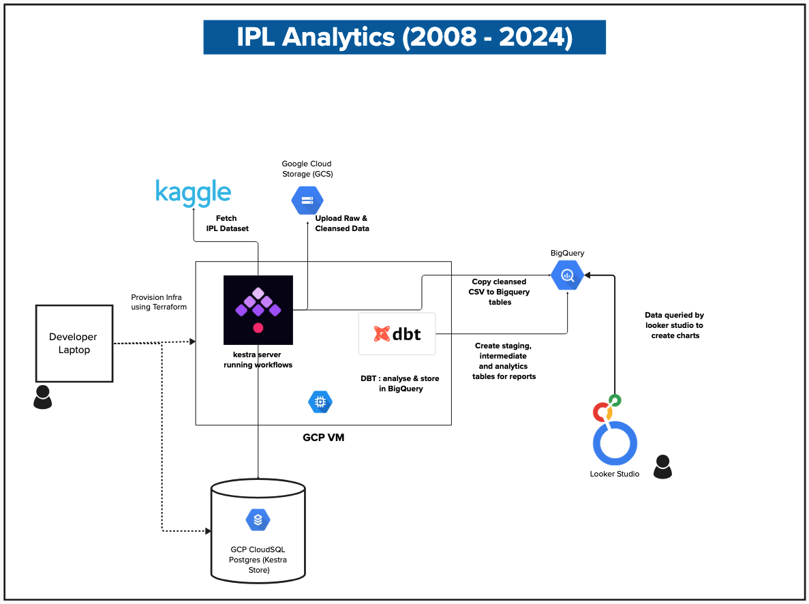
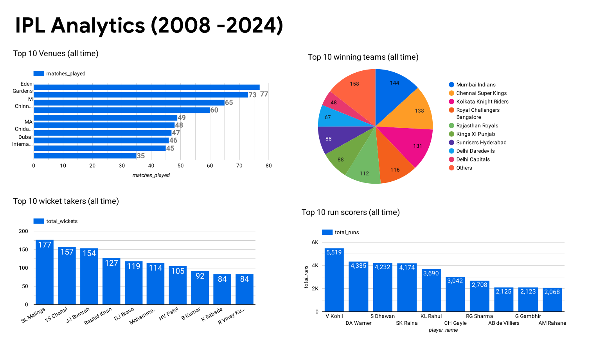

# IPL Indian Premier League Data Analysis
Project aims at analysing the IPL dataset from Kaggle. 

### Architecture and Infra
The entire project is built on GCP provisioned using Terraform, Workflows in Kestra, and DBT for analysis.
Following shows the architecture and data pipeline design.



Dataset provided 2 CSV files one containing specific match info and the other containing the ball by ball stat.
The analytics data is arrived at by processing the ball by ball data of approx 27MB

### Analysis output
3 key models are arrived at
1. Team performances over time
2. Top performers over time
3. Analysis of venues

#### Charts
4 charts were created using Google Looker Studio from the analytics data created from the data engineering workflow 

1. Total matches by venues
2. Top 10 wicket takers all time
3. Top 10 run scorers all time
4. Top winning teams all time

## Installation 

### Dataset used
Dataset used from Kaggle :
[IPL Complete Dataset (2008-2024)](https://www.kaggle.com/datasets/patrickb1912/ipl-complete-dataset-20082020)

### Prerequisites
1. create GCP project
2. create service account with following roles
   1. Compute admin (`roles/compute.admin`)
   2. BigQuery admin (`roles/bigquery.admin`)
   3. Storage Admin (`roles/storage.admin`)
   4. Storage Admin (`roles/cloudsql.admin`)
   5. IAM, SA user (`roles/iam.serviceAccountUser`)
   6. Logging, Log Writer (`roles/logging.logWriter`)
3. Create a service account key for the service account and download it as JSON
4. Enable the following APIs
   1. Compute Engine API
   2. BigQuery API
   3. Cloud Storage API
   4. Cloud SQL Admin API
5. export the following environment variables
   1. `export GOOGLE_APPLICATION_CREDENTIALS=/path/to/your/service-account-file.json`
   2. `export PROJECT_ID=your-project-id`
   3. `export REGION=us-central1`
   4. `export ZONE=us-central1-a`
6. Create an account in Kaggle

### 1. Setup TF VARS
Create `terraform.tfvars` files with the following variables
```
project_id            = ""
service_account_email = ""
kaggle_username       = ""
kaggle_key            = ""
```
### 2. Provision Kestra Server, DB , Upload Kaggle Dataset to GCS & BigQuery
From the data-engg-zc-2025-project/terraform/kestra directory, run the following commands to provision the Kestra server and database:
- This will provision the following
  1. GCP VM
  2. GCP Postgres Database
  3. GCS bucket
  4. BigQuery Tables
  5. Start the Kestra Server

```bash
terraform init
terraform apply -var-file=terraform.tfvars
```

### 3. Access the Kestra UI
Open the Kestra UI in your browser. The URL will be in the output of the terraform apply command. It will look like this:
```
http://<external-ip>:8080
```
### 4. Login to Kestra UI and create workflows
#### 4.1 Login to the Kestra UI using the following credentials:
   - Username: `admin@kestra.io`
   - Password: `kestra`

#### 4.2 Create the workflows in the data-engg-zc-2025-project/kestra directory
  - These workflows will download the dataset from Kaggle, cleanse the data, and upload it to GCS and BigQuery. 
    1. 00-ingest-from-kaggle-to-gcs.yml
    2. 01-cleanse-data-and-upload-to-gcs.yml
    3. 02-copy-gcs-data-to-bigquery.yml

### 5. Setup DBT and Create the Analytics Models in BigQuery
#### 5.1. SSH to the GCP VM and setup DBT

```
#!/bin/sh

# Update system packages
sudo apt-get update
sudo apt-get install -y python3 python3-pip
pip3 install virtualenv
python3 -m virtualenv dbt_env

# Activate the virtual environment
source dbt_env/bin/activate
pip install dbt-bigquery

# Create a directory for your project
mkdir -p ~/dbt_projects
cd ~/dbt_projects

# Initialize a new dbt project
dbt init ipl_analytics
cd ipl_analytics
mkdir -p ~/.dbt
```

#### 5.2 create the DBT model SQL files
- copy the profiles.yml from data-engg-zc-2025-project/dbt-projects/.dbt directory
- Replace the GCP keyfile in the path
- create the `models` directory in  `~/dbt_projects/ipl_analytics`
  - In `models` directory create 
    1. staging
    2. intermediate
    3. analytics
  - copy the SQL files in the repo at `data-engg-zc-2025-project/dbt-projects/ipl_analytics/models` 
  in the same order to the `models` folders in GCP VM

#### 5.3 dbt project yml
- update the `dbt_project.yml` in GCP vm from directory in  `~/dbt_projects/ipl_analytics`

#### 5.4 Run the models

- Test the connection from DBT to BigQuery
```
dbt debug
```

- Run models in order
```
dbt run --models staging
dbt run --models intermediate
dbt run --models analytics
```

### 6. Reports using Google Looker Studio

Following reports were created using the queries below from the analytics tables created in BigQuery using DBT



```
-- Total matches by venues

SELECT
  venue,
  SUM(matches_played) AS matches_played
FROM ipl_transformed.venue_analysis
GROUP BY venue

-- Top 10 wicket takers all time

SELECT 
  player_name, 
  sum(primary_stat) as total_wickets
from ipl_transformed.top_performers 
where category='bowler' 
group by player_name
order by total_wickets desc

-- Top 10 run scorers all time

SELECT 
  player_name, 
  sum(primary_stat) as total_runs
from ipl_transformed.top_performers 
where category='batsman' 
group by player_name
order by total_runs desc

-- Top winning teams all time

SELECT 
  team_name, 
  sum(matches_won) as total_wins
from ipl_transformed.team_performance 
group by team_name
order by total_wins DESC

```